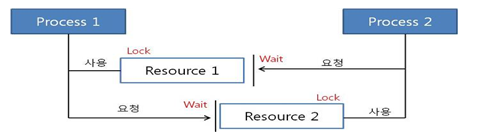

# 데이터 바인딩 추상화:PropertyEditor

스프링에서는 사용자가 입력한 값을 타겟 객체에 설정하는 데이터 바인딩 기능을 제공합니다.(옛 방식)

org.spirngframework.validation.DataBinder 인터페이스를 통해서 데이터 바인딩 기능을 지원하며, 사용자가 입력한 값을 도메인 모델에 동적으로 변환해서 넣어줍니다.

### Spring의 Data 바인딩

- 기술적인 관점: 프로퍼티 값을 타겟 객체에 설정하는 기능
- 사용자 관점: 사용자 입력값을 애플리케이션 도메인 모델에 동적으로 변환해 주는 기능
- 해석: 사용자의 입력값은 대부분 '문자열'인데, 그 값을 객체가 가지고 있는 데이터 타입은 int, long, Boolean, Date 입니다.
- 심지어 Event, Book 같은 도메인 타입으로도 변환해서 넣어줍니다.
- 즉, 사용자의 문자열 입력값을 자바의 데이터 타입으로 변환해서 넣어줄 때, 적절하게 데이터를 넣기 위한 데이터 바인딩이 필요합니다.

## PropertyEditor

- 스프링 3.0 이전까지 DataBinder가 변환 작업 사용하던 인터페이스입니다.
- 쓰레드 - 세이프 하지 않음(상태 정보 저장 하고 있음, 따라서 싱글톤 빈으로 등록해서 쓰다가는...)
- Object와 String 간의 변환만 할 수 있어, 사용 범위가 제한적 입니다.

```
Thread - Safe 란?
멀티 스레드 프로그래밍에서 일반적으로, 어떤 함수나 변수 혹은 객체가 여러 스레드로부터 동시에 접근이 이루어져도 프로그램의 실행에 문제가 없음을 말합니다.

```

<center></center>

#### Event 객체

```
public class Event {

    Integer id;
    String title;

    public Event(Integer id) {
        this.id = id;
    }

    public Event(Integer id, String title) {
        this.id = id;
        this.title = title;
    }

    public Integer getId() {
        return id;
    }

    public void setId(Integer id) {
        this.id = id;
    }

    @Override
    public String toString() {
        return "Event{" +
                "id=" + id +
                ", title='" + title + '\'' +
                '}';
    }
}
```

#### EventEditor

```
public class EventEditor extends PropertyEditorSupport {

    // 오브젝트 -> String
    @Override
    public String getAsText(){
        Event event = (Event)getValue();
        return event.getId().toString();
    }

    //String -> 오브젝트
    @Override
    public void setAsText(String text) throws IllegalArgumentException {
        setValue(new Event(Integer.parseInt(text)));
    }
}
```

- PropertyEditorSupport 클래스를 상속 받아 데이터 바인딩 클래스입니다.
- getAsText는 프로퍼티가 받은 객체를 getValue 메서드를 통해 가져오고 이 Event 객체를 문자열 정보로 변환해서 반환하는 역활을 합니다.
- setAsText는 사용자가 입력한 데이터를 Event 객체로 변환해 주는 역활을 합니다. event/1이라는 요청시, setAsText의 메서드가 호출되어 사용자 데이터를 변환합니다.
- getValue, setValue 메서드는 thread-safe하지 않습니다. 따라서 절대 스프링 빈으로 등록해서 쓰면 안됩니다.

#### EventController

```
@RestController
public class EventController {

    @InitBinder
    public void init(WebDataBinder webDataBinder) {
        webDataBinder.registerCustomEditor(Event.class, new EventEditor());
    }

    @GetMapping("/event/{event}")
    public String getEvent(@PathVariable Event event){
        System.out.println(event);
        return event.getId().toString();
    }
}
```

- EventEditor를 빈으로 사용하지 않고 @InitBinder 어노테이션을 통해 컨트롤러에 데이터 바인더로서 등록할 수 있습니다.

#### EventControllerTest

```
@RunWith(SpringRunner.class)
@WebMvcTest
public class EventControllerTest {

    @Autowired
    MockMvc mockMvc;

    @Test
    public void getTest() throws Exception {
        mockMvc.perform(get("/event/1"))
                .andExpect(status().isOk())
                .andExpect(content().string("1"));
    }
}
```

- /event/1 요청을 하고 요청을 통해서 받은 데이터가 1인지 체크하는 테스트를 작성했습니다.
