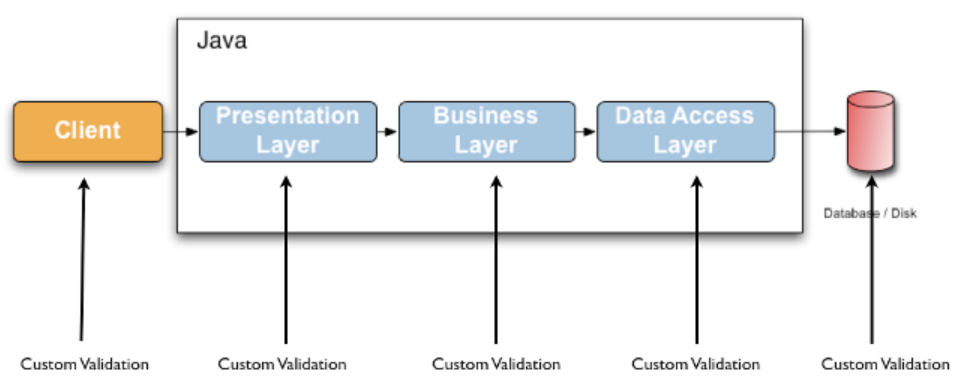
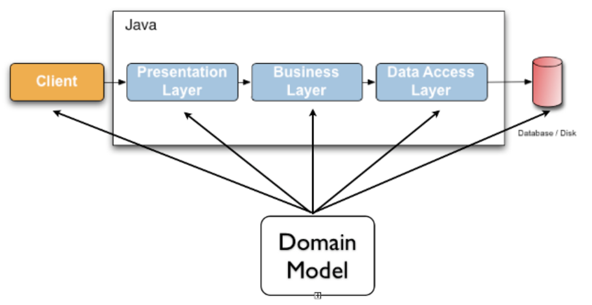

# Validation 추상화

org.springframework.validation.Validator
애플리케이션에서 사용하는 개체 검증용 인터페이스

- 특징

  - 어떠한 계층과도 관계가 없다. => 모든 계층(웹,서비스,데이터)에서 사용해도 좋다.
  - 구현체 중 하나로, JSR-303과 JSR-349을 지원한다.
  - DataBinder에 들어가 바인딩 할 때 같이 사용 되기도 한다.

- 인터페이스
  - boolean supports: 어떤 타입의 객체를 검증할 때 사용할 것인지 결정함
  - void validate: 실제 검증 로직을 이 안에서 구현
    - 구현할 때 ValidationUtils 사용하여 편리함

```
    boolean supports(Class<?> clazz) {
      // 인스턴스가 검증 대상 타입인지 확인
    }
    void validate(Object target, Errors errors) {
      // 실질적인 검증 작업
    }
```

- 스프링 부트 2.0.5 이상 버전을 사용할때
  - LocalValidatorFactoryBean 빈으로 자동 등록
  - JSR-380 구현체로 hibernate-validator 사용
  - https://beanvalidation.org/

[Bean Validation 1.0(JSR-303)](https://jcp.org/en/jsr/detail?id=303)
[Bean Validation 1.1(JSR-349)](https://jcp.org/en/jsr/detail?id=349)
[Bean Validation 2.0(JSR-380)](https://jcp.org/en/jsr/detail?id=380)

### Java Bean Validation

#### 일반적인 경우

<center></center>
일반적으로 데이터 검증은 여러 계층에 걸쳐서 이뤄지게 됩니다.
동일한 내용의 검증로직이 각 계층별로 구현된다면 그것은 중복이고 낭비가 심한 작업입니다.
또한 각 계층의 로직이 달라지면 검증 로직간 불일치로 인한 오류가 발생하기 쉽습니다.

#### 도메인 모델

<center></center>
데이터 검증을 위한 로직을 도메인 모델 자체에 묶어서 표현하는 방법이 있습니다.
Bean Validation 라는 이름으로 어노테이션을 데이터 검증을 위한 메타데이터로 사용하는 방법을 제시하고 있습니다.

[참고 URL](https://medium.com/@gaemi/java-%EC%99%80-spring-%EC%9D%98-validation-b5191a113f5c)

### hibernate-validator

```
hibernate-validator 란?
Bean Validation 명세에 대한 구현체입니다.

```

[참고 URL](https://medium.com/@gaemi/java-%EC%99%80-spring-%EC%9D%98-validation-b5191a113f5c)

#### 검증 대상 Event 클래스

```
  public class Event {

    Integer id;

    String title;

    public Integer getId() {
        return id;
    }

    public void setId(Integer id) {
        this.id = id;
    }

    public String getTitle() {
        return title;
    }

    public void setTitle(String title) {
        this.title = title;
    }
}
```

#### Event에 대한 validation을 처리할 Validator을 구현

```
import org.springframework.validation.Errors;
import org.springframework.validation.ValidationUtils;
import org.springframework.validation.Validator;

public class EventValidator implements Validator {

    @Override
    public boolean supports(Class<?> clazz) {
        return Event.class.equals(clazz);
    }

    @Override
    public void validate(Object target, Errors errors) {
        ValidationUtils.rejectIfEmptyOrWhitespace(errors, "title", "notempty", "Empty title is not allowed");
    }
}
```

title에 대해서 비어있거나 공백일 경우에는 errors에 에러 정보를 담는 로직

#### validation 작성

```
import org.springframework.boot.ApplicationArguments;
import org.springframework.boot.ApplicationRunner;
import org.springframework.stereotype.Component;
import org.springframework.validation.BeanPropertyBindingResult;
import org.springframework.validation.Errors;

import java.util.Arrays;

@Component
public class AppRunner implements ApplicationRunner {

    @Override
    public void run(ApplicationArguments args) throws Exception {
        // 에러를 발생시키기 위해 title 설정 안함
        Event event = new Event();

        // 검증할 객체 event를 전달하여 Errors 인스턴스 생성
        Errors errors = new BeanPropertyBindingResult(event, "event");

        // Validation 실행
        EventValidator eventValidator = new EventValidator();
        eventValidator.validate(event, errors);

        // 에러가 있는지
        System.out.println("hasErrors(): " + errors.hasErrors());

        // 발생한 에러를 순차적으로 순회하며 에러코드와 default message 출력
        errors.getAllErrors().forEach( e -> {
            System.out.println("=== Error Code ===");
            Arrays.stream(e.getCodes()).forEach(System.out::println);
            System.out.println(e.getDefaultMessage());
        });
    }
}
```

title 필드를 설정하지 않았기 때문에 에러 메시지가 발생합니다.

### LocalValidatorFactoryBean

Spring 프로젝트에서는 직접 구현보다는 LocalValidatorFactoryBean을 사용하는데 이 클래스는 Java EE의 Bean Validation 어노테이션들을 지원합니다. 특히, Spring Boot를 사용한다면 기본적으로 이 빈을 자동으로 등록해줍니다.

#### Event 클래스에 Bean Validation 어노테이션을 붙여줘야합니다.

```
import javax.validation.constraints.Email;
import javax.validation.constraints.Min;
import javax.validation.constraints.NotEmpty;

public class Event {

    Integer id;

    @NotEmpty
    String title;

    @Min(0)
    Integer limit;

    @Email
    String email;

    public Integer getId() {
        return id;
    }

    public void setId(Integer id) {
        this.id = id;
    }

    public String getTitle() {
        return title;
    }

    public void setTitle(String title) {
        this.title = title;
    }
}

```

- @NotEmpty -> 비어있으면 안됨
- @Min(0) -> 최솟값은 설정
- @Email -> 이메일 형식

- [Validation 도큐먼트](https://docs.jboss.org/hibernate/beanvalidation/spec/2.0/api/)

```
import org.springframework.beans.factory.annotation.Autowired;
import org.springframework.boot.ApplicationArguments;
import org.springframework.boot.ApplicationRunner;
import org.springframework.stereotype.Component;
import org.springframework.validation.BeanPropertyBindingResult;
import org.springframework.validation.Errors;
import org.springframework.validation.beanvalidation.LocalValidatorFactoryBean;

import java.util.Arrays;

@Component
public class AppRunner implements ApplicationRunner {


    @Autowired
    LocalValidatorFactoryBean validatorFactoryBean;

    @Override
    public void run(ApplicationArguments args) throws Exception {
        Event event = new Event();
        event.setLimit(-1);
        event.setEmail("1234");

        // 검증할 객체 event를 전달하여 Errors 인스턴스 생성
        Errors errors = new BeanPropertyBindingResult(event, "event");

        // Validation 실행
        validatorFactoryBean.validate(event, errors);

        // 에러가 있는지
        System.out.println("hasErrors(): " + errors.hasErrors());

        // 발생한 에러를 순차적으로 순회하며 에러코드와 default message 출력
        errors.getAllErrors().forEach( e -> {
            System.out.println("=== Error Code ===");
            Arrays.stream(e.getCodes()).forEach(System.out::println);
            System.out.println(e.getDefaultMessage());
        });
    }
}

```

- LocalValidatorFactoryBean을 주입 받습니다.
- Event 인스턴스를 생성하고 에러를 의도적으로 발생시키기 위해 값을 셋팅합니다.
